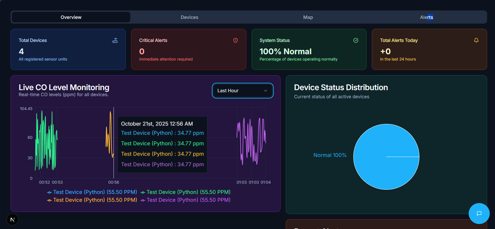
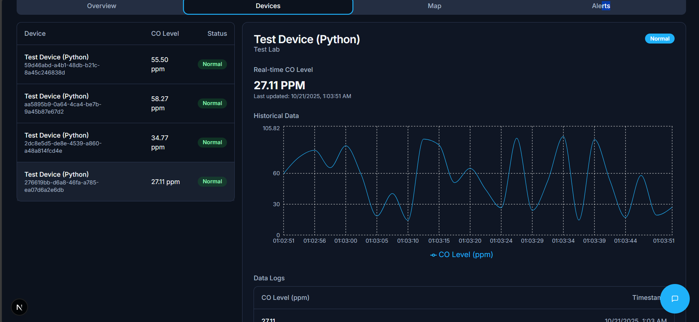

# ExoX: Real-Time Environmental Monitoring Dashboard

ExoX is a modern, real-time dashboard designed to monitor environmental sensor data. It provides a centralized interface to visualize critical metrics, such as Carbon Monoxide (CO) levels, from multiple IoT devices. The application features real-time data updates, an interactive map, automated alerts, and a helpful AI chatbot for data queries.

This project was originally built using Firebase and has been migrated to use **Supabase** for its backend services, including the database, real-time subscriptions, and user authentication.

## Key Features

*   **Real-Time Data Streams**: Displays live sensor readings using Supabase's real-time capabilities, ensuring the dashboard is always up-to-date without needing to refresh.
*   **Google Authentication**: Secure and easy user sign-in powered by Supabase Auth.
*   **Interactive Device Map**: Visualizes the geographical location of each sensor on an interactive map.
*   **Alert System**: Automatically triggers visual and auditory alerts for devices reporting 'Warning' or 'Critical' CO levels.
*   **Historical Data Charts**: Provides historical data visualizations for each device, allowing for trend analysis.
*   **AI Chatbot**: An integrated chatbot, powered by Google Gemini, allows users to ask natural language questions about the sensor data (e.g., "Which device has the highest CO level?" or "List all critical devices.").

## Screenshots

**Main Dashboard View**
*A comprehensive overview of all connected devices, their current status, and recent alerts.*



**Device Details and Map View**
*An interactive map showing device locations, along with detailed historical data for a selected device.*



## Tech Stack

*   **Framework**: [Next.js](https://nextjs.org/)
*   **Language**: [TypeScript](https://www.typescriptlang.org/)
*   **Backend & Database**: [Supabase](https://supabase.io/) (PostgreSQL)
*   **Authentication**: [Supabase Auth](https://supabase.io/docs/guides/auth)
*   **AI Chatbot**: [Google Gemini](https://ai.google.dev/)
*   **UI Components**: [Shadcn UI](https://ui.shadcn.com/), [Radix UI](https://www.radix-ui.com/)
*   **Styling**: [Tailwind CSS](https://tailwindcss.com/)
*   **Charting**: [Recharts](https://recharts.org/)
*   **Map**: [Google Maps API](https://developers.google.com/maps)

## Getting Started

Follow these instructions to get the project running on your local machine for development and testing purposes.

### Prerequisites

*   Node.js (v18 or later)
*   npm or yarn
*   A Supabase account
*   A Google Cloud account (for Gemini and Google Maps APIs)

### 1. Clone the Repository

```bash
git clone <your-repository-url>
cd <repository-folder>
```

### 2. Install Dependencies

```bash
npm install
```

### 3. Set Up Supabase

1.  **Create a new Supabase Project** from your [Supabase Dashboard](https://supabase.com/dashboard).
2.  **Create Database Tables**: In your Supabase project, navigate to the **SQL Editor** and run the following script to create the `devices` and `readings` tables and enable real-time updates:

    ```sql
    -- Create the devices table
    CREATE TABLE devices (
        id UUID PRIMARY KEY DEFAULT gen_random_uuid(),
        name TEXT NOT NULL,
        location TEXT,
        lat DOUBLE PRECISION,
        lng DOUBLE PRECISION,
        created_at TIMESTAMPTZ DEFAULT now()
    );

    -- Create the readings table
    CREATE TABLE readings (
        id UUID PRIMARY KEY DEFAULT gen_random_uuid(),
        device_id UUID REFERENCES devices(id) ON DELETE CASCADE,
        co_level DOUBLE PRECISION NOT NULL,
        timestamp TIMESTAMPTZ NOT NULL,
        created_at TIMESTAMPTZ DEFAULT now()
    );

    -- Enable Realtime on both tables
    alter publication supabase_realtime add table devices;
    alter publication supabase_realtime add table readings;
    ```

### 4. Configure Environment Variables

Create a new file named `.env.local` in the root of your project and add the following environment variables. You can get these keys from your Supabase and Google Cloud project settings.

```
# Supabase Credentials
NEXT_PUBLIC_SUPABASE_URL=YOUR_SUPABASE_PROJECT_URL
NEXT_PUBLIC_SUPABASE_ANON_KEY=YOUR_SUPABASE_ANON_PUBLIC_KEY
SUPABASE_SERVICE_KEY=YOUR_SUPABASE_SERVICE_ROLE_SECRET

# Google Gemini API Key
GEMINI_API_KEY=YOUR_GEMINI_API_KEY

# Google Maps API Key
NEXT_PUBLIC_GOOGLE_MAPS_API_KEY=YOUR_GOOGLE_MAPS_API_KEY
```

### 5. Run the Application

Start the development server:

```bash
npm run dev
```

The application will be available at `http://localhost:3000`.

### 6. Seed the Database (Optional)

To populate your database with initial sample data, open your browser and navigate to the following endpoint after starting the application:

**http://localhost:3000/api/seed**

This will add three sample devices to your `devices` table.
